# Lab 01: GitHub Identity, Student Portal Registration, and Ubuntu Server Installation

## Lab Objective

In this lab, you will create and correctly configure your GitHub account, register yourself in the Student Marks Portal, install Ubuntu Server in VMware Workstation Pro, verify your required Linux identity, and connect to the server remotely from Windows.

## Important Identity Requirement

Your identity must remain consistent throughout this lab:

- Enter your complete actual name in your GitHub profile.
- Choose a professional GitHub username related to your actual name.
- Use the same GitHub account to sign in to the Student Marks Portal.
- Enter your actual registration number, course code, and section in the portal.
- Use your exact GitHub username as your Ubuntu username.
- Use `ubuntu` as the Ubuntu server name.

Your Ubuntu terminal prompt must follow this pattern:

```text
<github-username>@ubuntu:~$
```

For example, if the GitHub username is `waqassaleem97`, the terminal prompt should be:

```text
waqassaleem97@ubuntu:~$
```

## Required Folder Structure

The `README.md` file and the instructional images are provided by the instructor. You must create the `screenshots` directory and prepare your own `Lab1_Solution.pdf`.

Your completed Lab 01 directory must follow this structure:

```text
CC/
└── Labs/
    └── Lab01/
        ├── README.md
        ├── Lab1_Solution.pdf
        └── screenshots/
            └── (screenshots of your completed tasks)
```

Follow these rules:

- Save every screenshot of your work inside `Labs/Lab01/screenshots/`.
- Use the exact screenshot filenames specified in this README.
- Create `Lab1_Solution.pdf` yourself after completing the lab.
- Add your screenshots to `Lab1_Solution.pdf` in the same order as the tasks.
- The **Grade Approved Students** GitHub Actions workflow checks the `screenshots` directory, not the images embedded only in the PDF.

## Task List

- [Getting Started](#getting-started)
- [Task 1: Create and Configure Your GitHub Account](#task-1-create-and-configure-your-github-account)
- [Task 2: Register in the Student Marks Portal](#task-2-register-in-the-student-marks-portal)
- [Task 3: Download VMware Workstation Pro and Ubuntu Server](#task-3-download-vmware-workstation-pro-and-ubuntu-server)
- [Task 4: Create the Ubuntu Server Virtual Machine](#task-4-create-the-ubuntu-server-virtual-machine)
- [Task 5: Choose the Installation Language](#task-5-choose-the-installation-language)
- [Task 6: Configure the Keyboard Layout](#task-6-configure-the-keyboard-layout)
- [Task 7: Choose the Ubuntu Server Installation Type](#task-7-choose-the-ubuntu-server-installation-type)
- [Task 8: Configure the Network](#task-8-configure-the-network)
- [Task 9: Configure Storage](#task-9-configure-storage)
- [Task 10: Select the Installation Disk](#task-10-select-the-installation-disk)
- [Task 11: Review the Partitions](#task-11-review-the-partitions)
- [Task 12: Confirm the Storage Changes](#task-12-confirm-the-storage-changes)
- [Task 13: Configure the Ubuntu Profile](#task-13-configure-the-ubuntu-profile)
- [Task 14: Complete the Software Installation](#task-14-complete-the-software-installation)
- [Task 15: Reboot and Verify the Ubuntu Identity](#task-15-reboot-and-verify-the-ubuntu-identity)
- [Task 16: Find the Ubuntu Server IP Address](#task-16-find-the-ubuntu-server-ip-address)
- [Task 17: Connect to Ubuntu Server from Windows](#task-17-connect-to-ubuntu-server-from-windows)
- [Task 18: Prepare Lab1 Solution PDF](#task-18-prepare-lab1-solution-pdf)
- [Final Submission Checklist](#final-submission-checklist)

## Getting Started

1. Create the following directory inside your `CC` repository:

   ```text
   Labs/Lab01/screenshots/
   ```

   - Save a screenshot showing the created directory structure as `lab01_folder_structure.png`.

2. Read the complete task list before beginning the installation.


## Task 1: Create and Configure Your GitHub Account

1. Open [GitHub Sign Up](https://github.com/signup) and create your personal GitHub account.

   - Use your own email address and actual identity.
   - Do not create an account using another student's information.

2. Choose a professional GitHub username related to your actual name.

   - Do not use spaces in the GitHub username.
   - Prefer lowercase letters and numbers because the same username will be used in Ubuntu.
   - Save a screenshot clearly showing your profile name and GitHub username as `github_profile.png`.


3. Open **GitHub > Settings > Public profile**.

   - Enter your complete actual name in the **Name** field.
   - Save a screenshot showing the completed Name field as `github_actual_name.png`.

> Do not include your password, access token, recovery codes, or other private credentials in any screenshot.

## Task 2: Register in the Student Marks Portal

1. Open the [Student Marks Portal](https://studentsreportcard-809ae.web.app/).

   - Save a screenshot of the portal login page as `portal_login_page.png`.

2. Select **Continue with GitHub** and sign in using the GitHub account created in Task 1.


3. Enter your actual registration number using the format provided by your instructor, for example:

   ```text
   2024-BSE-00
   ```

4. Select the correct course code.

5. Select your actual section, either **A** or **B**.


6. Review your information and submit the enrollment for approval.

   - Save a screenshot showing your GitHub profile information inside the portal as `portal_github_profile.png`.
   - Save a screenshot of the submitted or pending enrollment as `portal_enrollment_submitted.png`.

> A registration number belongs to only one student. Never enter another student's registration number.

## Task 3: Download VMware Workstation Pro and Ubuntu Server

1. Download and install VMware Workstation Pro on your Windows computer.

   - If VMware Workstation Pro is already installed, open it and verify that it works.
   - Save a screenshot showing VMware Workstation Pro running as `vmware_workstation.png`.

2. Open the [Ubuntu Server download page](https://ubuntu.com/download/server) and download the latest Ubuntu Server LTS ISO.

   - Save a screenshot showing the downloaded Ubuntu Server ISO filename as `ubuntu_server_iso.png`.

3. Confirm that at least 20 GB of free storage is available for the Ubuntu Server virtual machine.

   - Save a screenshot showing the available storage as `available_storage.png`.

## Task 4: Create the Ubuntu Server Virtual Machine

1. Open VMware Workstation Pro and select **Create a New Virtual Machine**.

   - Save a screenshot of the New Virtual Machine Wizard as `vm_creation_wizard.png`.

2. Select **Typical (recommended)** as the virtual machine configuration.

   - Save a screenshot showing this selection as `vm_typical_configuration.png`.

3. Select **Installer disc image file (ISO)** and browse to the Ubuntu Server ISO downloaded in Task 3.

   - Save a screenshot showing the selected Ubuntu ISO path as `vm_ubuntu_iso_selected.png`.

4. Allocate at least 20 GB of virtual disk space and complete the virtual machine wizard.

   - Save a screenshot showing the final virtual machine configuration as `vm_configuration_summary.png`.

5. Power on the virtual machine and wait for the Ubuntu Server installer to start.

   - Save a screenshot of the Ubuntu Server boot screen as `ubuntu_installer_boot.png`.

### Instructional reference

The following image is provided to help you recognize the Ubuntu Server boot screen:

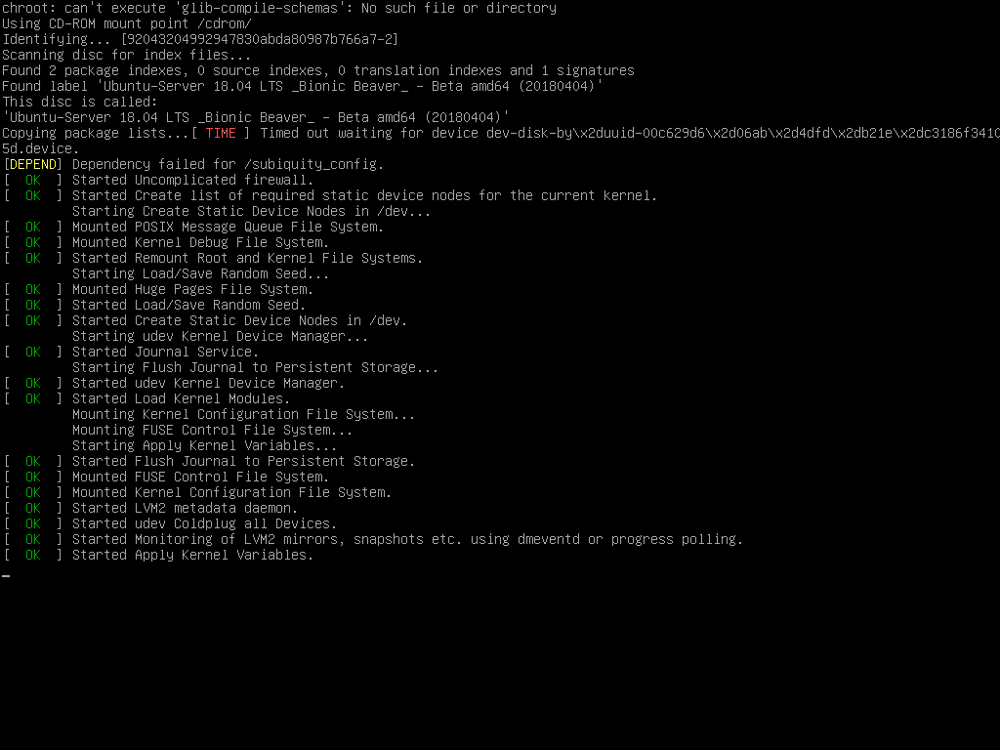

## Task 5: Choose the Installation Language

1. Use the arrow keys to select the required installation language.

   - Save a screenshot showing the selected language as `ubuntu_language.png`.

2. Press **Enter** to continue.

### Instructional reference

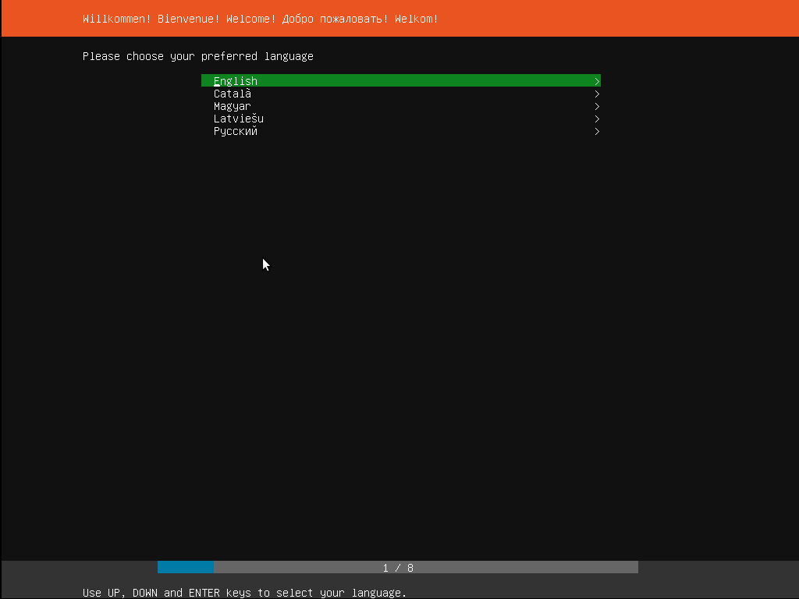

## Task 6: Configure the Keyboard Layout

1. Select the keyboard layout that matches your keyboard.

   - Save a screenshot showing the selected keyboard layout as `ubuntu_keyboard_layout.png`.

2. Select the appropriate keyboard variant.

   - Save a screenshot showing the selected keyboard variant as `ubuntu_keyboard_variant.png`.

3. Select **Done** to continue.

### Instructional references

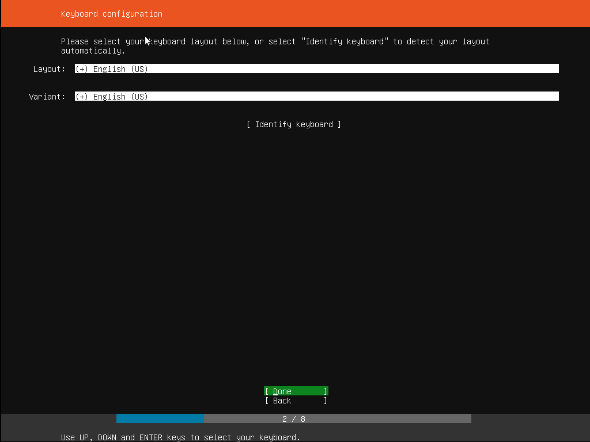

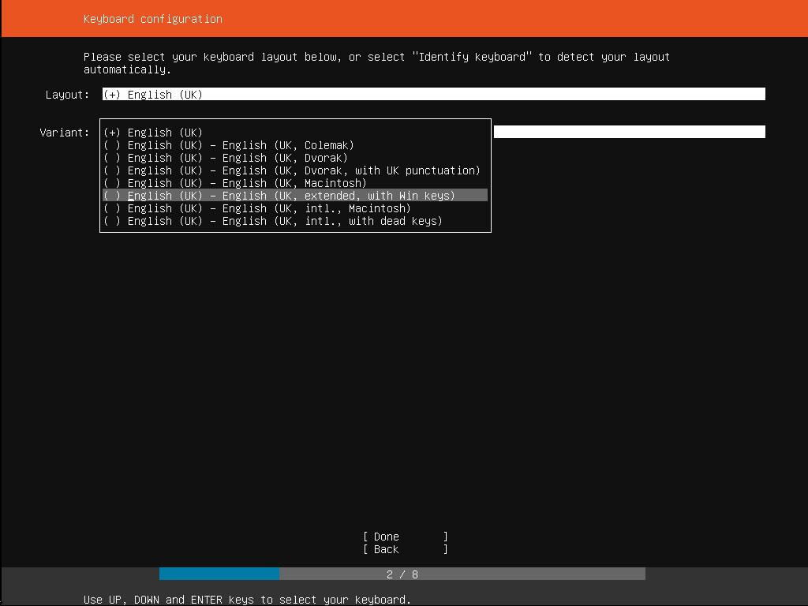

## Task 7: Choose the Ubuntu Server Installation Type

1. Select the normal Ubuntu Server installation option.

   - Do not select a MAAS installation unless your instructor specifically asks for it.
   - Save a screenshot showing the selected installation type as `ubuntu_installation_type.png`.

2. Continue to the next installer screen.

### Instructional reference

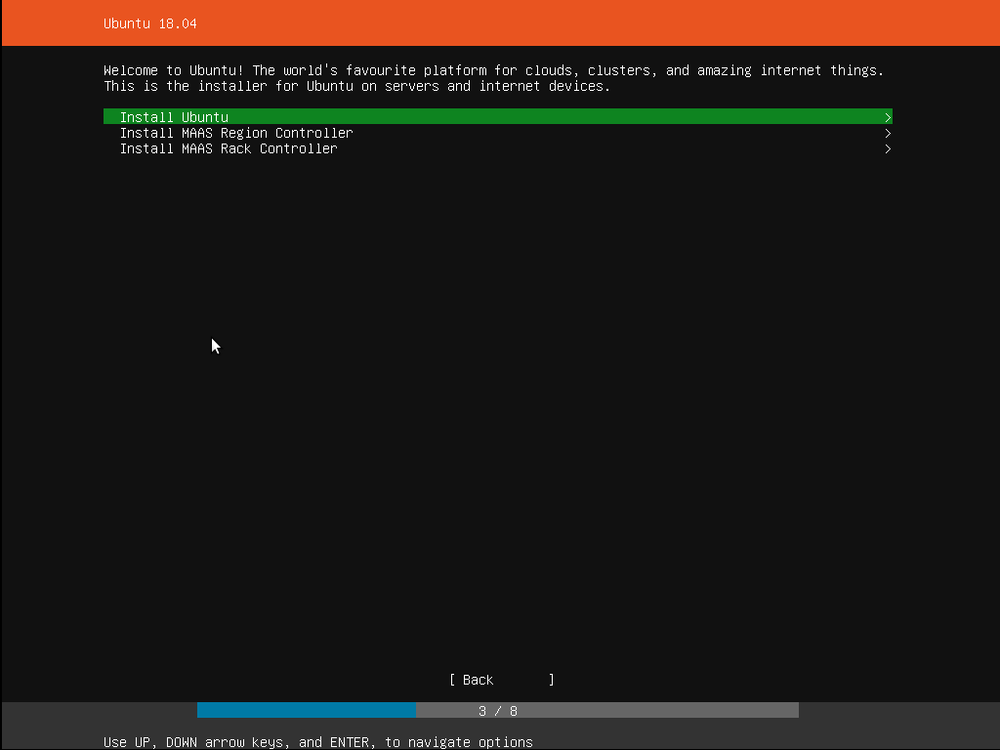

## Task 8: Configure the Network

1. Review the network interface detected by the Ubuntu Server installer.

   - Save a screenshot showing the detected network interface as `ubuntu_network_interface.png`.

2. Confirm that the interface has received an IP address automatically through DHCP.

   - Save a screenshot showing the assigned network address as `ubuntu_installer_network.png`.

3. Continue when the network configuration is correct.

### Instructional reference

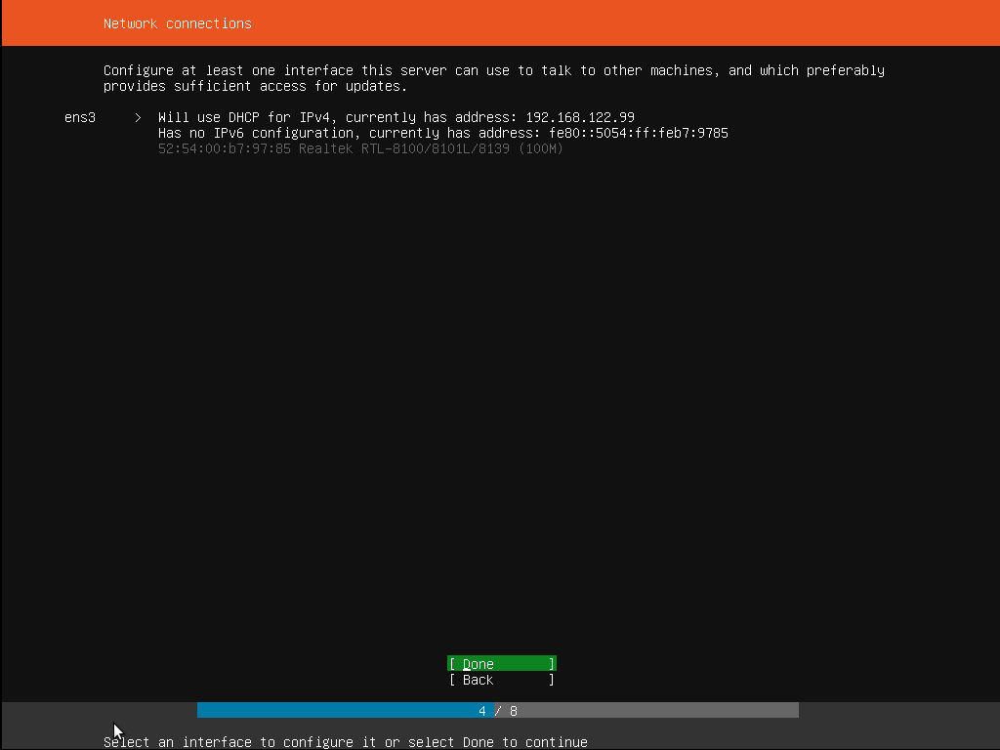

## Task 9: Configure Storage

1. Select the guided storage option to use the VMware virtual disk.

   - Save a screenshot showing the selected guided storage option as `ubuntu_guided_storage.png`.

2. Review the storage configuration before continuing.

   - Save a screenshot of the storage configuration as `ubuntu_storage_configuration.png`.

> Use only the VMware virtual disk created for this lab. Selecting or formatting the wrong physical disk can destroy existing data.

### Instructional reference

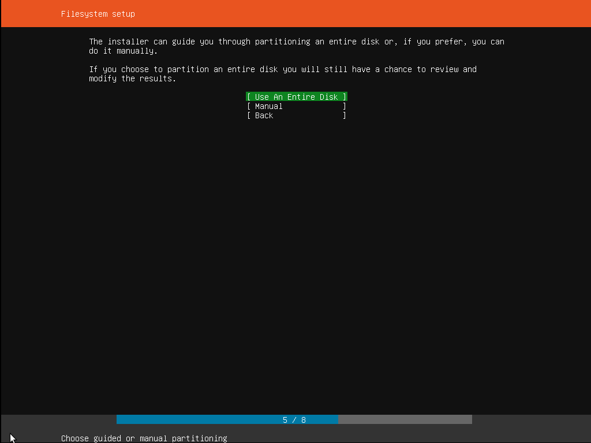

## Task 10: Select the Installation Disk

1. Select the virtual disk created for the Ubuntu Server virtual machine.

   - Save a screenshot showing the selected disk as `ubuntu_selected_disk.png`.

2. Check the displayed disk size and make sure it is the correct VMware virtual disk.

   - Save a screenshot showing the disk name and size as `ubuntu_disk_details.png`.

### Instructional reference

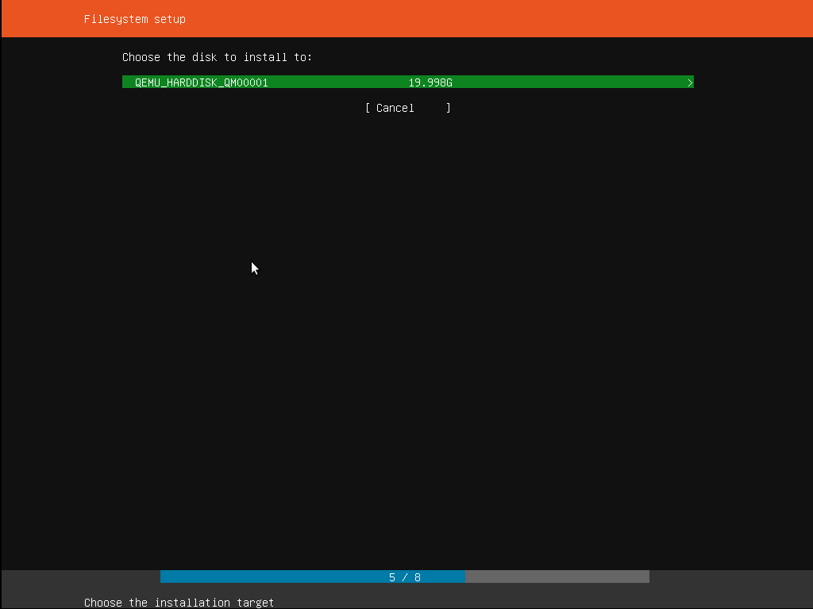

## Task 11: Review the Partitions

1. Review the partition layout proposed by the Ubuntu Server installer.

   - Save a screenshot showing the proposed partitions as `ubuntu_partition_layout.png`.

2. Confirm that the partitions belong to the VMware virtual disk.

3. Select **Done** only after reviewing the complete layout.

### Instructional reference

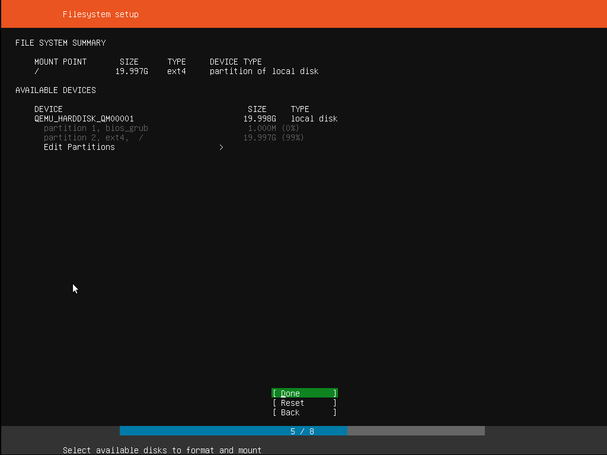

## Task 12: Confirm the Storage Changes

1. Read the destructive-action warning carefully.

   - Save a screenshot showing the final warning as `ubuntu_storage_warning.png`.

2. Confirm the changes only when you are certain that the VMware virtual disk is selected.

   - Save a screenshot showing the confirmation selection as `ubuntu_storage_confirmed.png`.

### Instructional reference

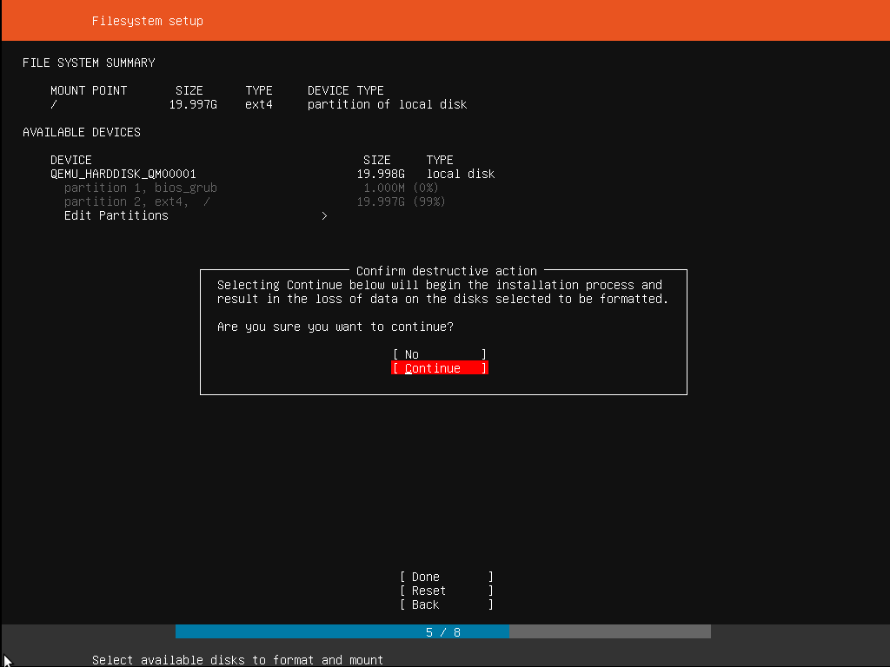

## Task 13: Configure the Ubuntu Profile

Complete the Ubuntu profile using the following required values:

| Installer field | Required value |
| --- | --- |
| Your name | Your complete actual name |
| Your server's name | `ubuntu` |
| Pick a username | Your exact GitHub username |
| Choose a password | A secure password you can remember |

1. Enter your complete actual name in the **Your name** field.

   - Save a screenshot showing the entered name as `ubuntu_actual_name.png`.

2. Enter `ubuntu` in the **Your server's name** field.

   - Save a screenshot showing the server name as `ubuntu_server_name.png`.

3. Enter your exact GitHub username in the **Pick a username** field.

   - Save a screenshot showing the Ubuntu username as `ubuntu_username.png`.

4. Choose and confirm a secure password.

   - Do not expose your password in any screenshot.

5. Review all profile fields before continuing.

   - Save a screenshot of the completed profile page as `ubuntu_profile_setup.png`.

### Instructional reference

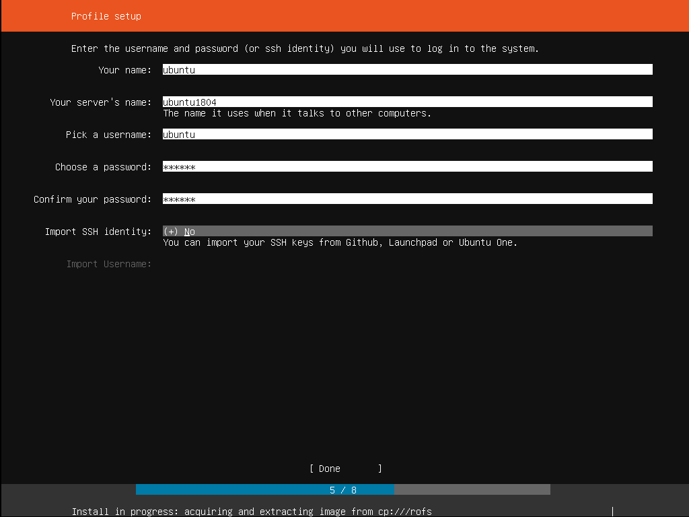

## Task 14: Complete the Software Installation

1. Wait while Ubuntu Server installs the required software.

   - Save a screenshot showing the installation progress as `ubuntu_installation_progress.png`.

2. Do not power off the virtual machine during the installation.

3. Wait until the installer reports that the installation is complete.

### Instructional reference

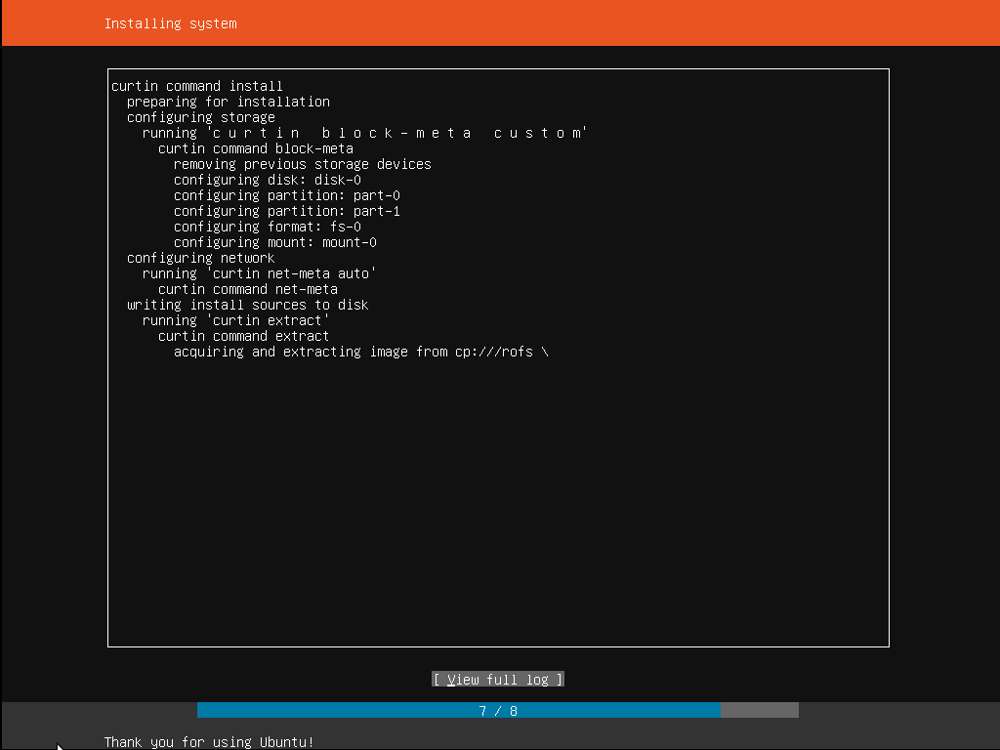

## Task 15: Reboot and Verify the Ubuntu Identity

1. When the installation completes, select **Reboot Now**.

   - Save a screenshot of the installation-complete screen as `ubuntu_installation_complete.png`.

2. Disconnect the Ubuntu ISO if VMware asks you to remove the installation media.

3. Allow the installed Ubuntu Server to start.

   - Save a screenshot showing the Ubuntu login screen as `ubuntu_login_screen.png`.

4. Sign in using the Ubuntu username and password configured in Task 13.

   - Save a screenshot showing the successful terminal login as `ubuntu_terminal_login.png`.

5. Verify that the terminal prompt follows this format:

   ```text
   <github-username>@ubuntu:~$
   ```

   - Save a clear screenshot showing the complete prompt as `ubuntu_identity_verified.png`.

### Instructional reference

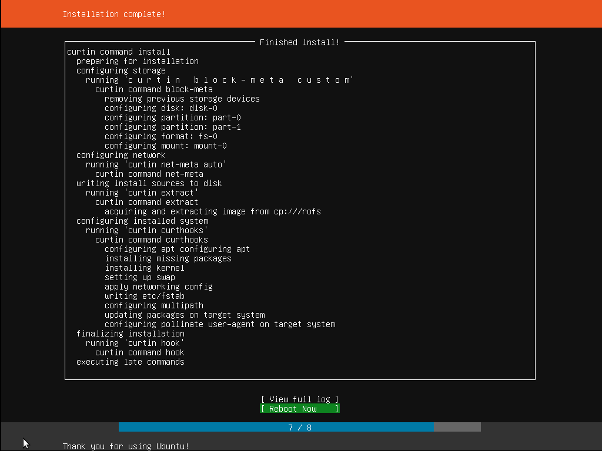

## Task 16: Find the Ubuntu Server IP Address

1. Run the following command inside Ubuntu Server:

   ```bash
   ip addr
   ```

   - Save a screenshot showing the command and its output as `ubuntu_ip_addr_command.png`.

2. Find the IPv4 address shown after `inet` for the active network interface.

   - Do not use `127.0.0.1`; it is the loopback address.
   - Save a screenshot clearly showing the correct IPv4 address as `ubuntu_ip_address.png`.

3. Keep your `<github-username>@ubuntu` prompt visible in the screenshot.

## Task 17: Connect to Ubuntu Server from Windows

1. Keep the Ubuntu Server virtual machine powered on.

   - Save a screenshot showing the running virtual machine as `ubuntu_vm_running.png`.

2. Open Command Prompt or PowerShell on Windows.

   - Save a screenshot showing the Windows terminal as `windows_terminal.png`.

3. Run the following SSH command, replacing the placeholders with your Ubuntu username and server IP address:

   ```powershell
   ssh <github-username>@<ubuntu-server-ip>
   ```

   - Save a screenshot showing the SSH command as `windows_ssh_command.png`.

4. Type `yes` if you are asked to accept the server fingerprint.

   - Save a screenshot showing the accepted fingerprint as `windows_ssh_fingerprint.png`.

5. Enter your Ubuntu password and complete the remote login.

   - The password will not appear while you type; this is normal.
   - Do not expose your password in a screenshot.
   - Save a screenshot showing the successful SSH session as `windows_ssh_login.png`.

6. Verify that the remote prompt displays `<github-username>@ubuntu`.

   - Save a clear screenshot showing the remote prompt as `windows_ssh_identity.png`.

If SSH is unavailable, install and start OpenSSH Server inside Ubuntu:

```bash
sudo apt update
sudo apt install -y openssh-server
sudo systemctl enable --now ssh
```

If you use these commands:

- Save a screenshot showing the OpenSSH installation as `openssh_installation.png`.
- Save a screenshot showing the active SSH service as `openssh_service.png`.

## Task 18: Prepare Lab1 Solution PDF

1. Create a new document and add a title page containing:

   - Lab number and title
   - Your complete actual name
   - Your registration number
   - Course code
   - Section
   - GitHub username

   - Save a screenshot of the completed title page as `solution_title_page.png`.

2. Add headings for Tasks 1 through 17.

3. Under each heading, insert the screenshots for that task in the same order used in this README.

4. Add a short caption below every screenshot explaining what it demonstrates.

5. Check that every screenshot is clear and readable.

6. Export the completed document using this exact filename:

   ```text
   Lab1_Solution.pdf
   ```

   - Save a screenshot showing the exported PDF as `lab1_solution_pdf.png`.

7. Place the PDF at:

   ```text
   Labs/Lab01/Lab1_Solution.pdf
   ```

8. Keep all original screenshots inside `Labs/Lab01/screenshots/` for automatic grading.

## Screenshot Rules

- Every screenshot must be created from your own work.
- Save every screenshot inside `Labs/Lab01/screenshots/`.
- Use the exact filename written after each step.
- Screenshots must be clear and readable.
- Show the relevant window, command, output, or identity information.
- Do not crop out the terminal prompt when it is required.
- Do not edit a screenshot to add, remove, or replace evidence.
- Do not copy or reuse another student's screenshots.
- Do not expose passwords, access tokens, recovery codes, or private keys.
- The instructional images inside `images/install-ubuntu-server/` are examples and must not be submitted as your own evidence.

Missing, unclear, incorrectly named, misplaced, edited, or copied evidence may receive zero marks for the affected task.

## Final Submission Checklist

- [ ] `README.md` remains inside `Labs/Lab01/`.
- [ ] The instructor-provided `images/install-ubuntu-server/` directory remains unchanged.
- [ ] `Lab1_Solution.pdf` was created by me and placed inside `Labs/Lab01/`.
- [ ] Every original evidence screenshot is inside `Labs/Lab01/screenshots/`.
- [ ] My GitHub profile contains my complete actual name.
- [ ] My GitHub username is professional and suitable as an Ubuntu username.
- [ ] I used the same GitHub account for the Student Marks Portal.
- [ ] I entered my correct registration number, course code, and section.
- [ ] Ubuntu Server was installed inside VMware Workstation Pro.
- [ ] My Ubuntu username exactly matches my GitHub username.
- [ ] My Ubuntu server name is `ubuntu`.
- [ ] My local terminal prompt shows `<github-username>@ubuntu`.
- [ ] I identified the correct Ubuntu Server IPv4 address.
- [ ] I successfully connected to Ubuntu Server from Windows using SSH.
- [ ] My remote SSH prompt shows `<github-username>@ubuntu`.
- [ ] Every screenshot uses the exact required filename.
